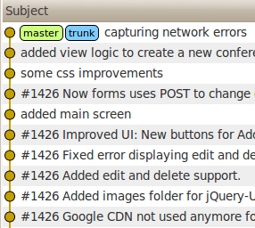
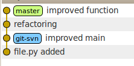
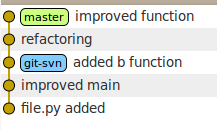
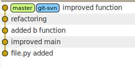
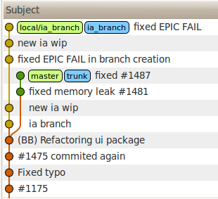
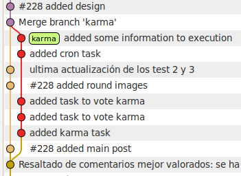
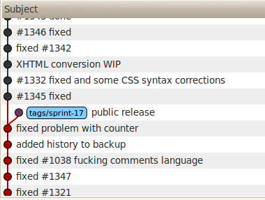

Git+SVN
=======

----

TOC
===

- Introducción GIT
- Workflow con GIT vs servidores Subversion
- Ejemplos
- Conclusiones

----

Avisos
======

- Hablo en base a la experiencia de mi trabajo diario.
    - Entorno empresarial (svn centralizado)
    - Closed source :)
    - siempre trabajo en linea de comandos

Pues eso, posiblemente no sea la mejor manera, pero funciona.

- El SCM es un medio, no el fin
    - Por tanto lo uso adecuándolo a lo que necesito
 
Muchas veces nos volvemos locos con el SCM olvidando que es una herramienta para obtener un objetivo.

---

Intro: Git como cliente svn 
===========================

- Acceder a servidores subversion usando git

Subversion ya no mola, pero aunque no mole sigue funcionando bien y en muchas empresas. Git, Mercurial y otros SCM tienen funcionalidades añadidas que facilitan la vida al desarrollador, así que ¿por qué no usar ambos?

- Por qué no migrar: cambiar es difícil

Cambiar de sistema de control de versiones es [muy] difícil. Por un lado la gente debería acostumbrarse, habría que migrar todo los proyectos, configurar los servidores, permisos, fallitos, ñapas varias... uff. 

- Git. Integración *casi* perfecta

Existen otros SCM distribuídos, mercurial, bazaar, plastic SCM... git tiene buena documentación (ver links al final de la presentación) y se integra con subversion a las mil maravillas. Mercurial es más simple de entender para alguien que viene de Subversion, pero la integración con svn no es tan buena, por lo menos a día de hoy.

---

GIT: introducción rápida
========================

- Git es un sistema de control de *versiones* distribuído

Dicho de otra forma, en vez de tener un repositorio central donde están alojadas todas las versiones, ahora tenemos en nuestra máquina todo el repositorio. En concreto en Git el repositorio se aloja en la carpeta especial .git

versiones va en cursiva por que el propio Linus, creador de git, dice; *"it's content-addressable, and it has a notion of versioning,"*

Comandos básicos:

    !bash
    $ git init
    Initialized empty Git repository in /Users/javi/tmp/repo/.git/
    $ echo 'python FTW' > file
    $ git add file
    $ git ci -m "1st commit"
    [master (root-commit) a9270d1] 1st commit
     1 files changed, 1 insertions(+), 0 deletions(-)
     create mode 100644 file

- Los comandos básicos son similares a Subversion
    + git clone url <=>   svn checkout url
    + git pull      <=>   svn update
    + git add       <=>   svn add

Hay que tener cuidado, porque aunque algunos de los comandos se llaman igual pero no hacen lo mismo, por ejemplo revert.

---

Trabajando contra un servidor
=============================

- En subversion se trabaja siempre contra un repositorio.
 

.notes: http://svnbook.red-bean.com/nightly/en/svn-book.html fuente de la imagen

Hasta ahora siempre hemos trabajado con un repositorio, normalmente alojado en un servidor, nos bajamos el código, trabajamos sobre él y subimos.

- En git podemos trabajar en local y después *sincronizar* con otros repositorios.

.notes: http://progit.org/book/ch5-1.html

Con git podemos sincronizar con otros repositorios, no necesariamente debe haber uno central, aunque podemos trabajar en local sin problema, esto es, hacer commits, crear ramas, etc. Además el workflow es más variado ya que permite además de trabajar con el modelo cliente servidor de toda la vida, trabajar en repositorios intermedios, con repositorios de gente que integra.

---

Workflow
========

---

Punto de partida
================

- Queremos tener la potencia de Git pero en nuestra empresa usan subversion
- Tenemos el típico repositorio subversion con trunk/branchs/tags
    - https://svn.company.com/project/

Podría tener otra estructura, git-svn se adapta perfectamente

- Tenemos instalado el cliente de git (git-core) y git-svn

git-core y git-svn son los paquetes para ubuntu, en cada plataforma cada uno se las apañe para instalar git.

- Es conveniente tener instalado un cliente gráfico para ver el progreso
    - gitx (osx)
    - gitg (linux)
    - gitk (.*)

Seguro que hay otros clientes gráficos, como git-tower, pero no los he usado.

---

Workflow I: Bajando el repositorio
==========

- Flujo de trabajo *pasado de moda*

Comandos teniendo en cuenta que no haya conflictos:

    !bash
    $ svn checkout https://svn/trunk
    $ cd trunk
    $ vim file.py
    hack hack hack
    $ svn up # sin conflictos
    $ svn commit -m "epic win feature, refs #1337"

- Comenzamos con git-svn: Bajamos el repositorio

Comandos:

    !bash
    $ git svn init -s https://svn/ # inicializa el repositorio git
    $ git svn fetch # baja tooodas las revisiones

- Estado del repo
    

Aquí git se baja _todo el repositorio_, esto es, todas y cada una de las revisiones en local. Cabe la posibilidad de no bajar todo, ver las opciones del comando git-svn init. También es posible hacer git svn clone directamente.

Si solo quisiesemos bajar una parte del repositorio sería posible usando la URL a la carpeta en cuestión, de la misma forma que con subversion podemos solo bajar una parte del repositorio (mini punto para subversion).

---

Workflow II: Haciendo cambios
===========

- Empezamos a trabajar

Comandos:

    !bash
    $ vim file.py
    hack 
    $ git add file.py
    $ git commit -m "refactoring"
    hack 
    $ git add file.py
    $ git commit -m "improved function"

- Primeros cambios
    - **add** antes de commit: con svn no sólo hacemos add cuando no está bajo control de versiones

En git hay una fase intermedia entre los cambios que hacemos y el repositorio local, se llama *staging area* y ahí debemos aculumar los cambios que queramos almacenar en el siguiente changeset.

- cambios en el repositorio __local__
    

---

Workflow III: Sincronizando
============

- Tenemos en local, pero hay que subirlo al repositorio subversion
    - Sabemos que los demás usuarios plebeyos de subversion no se merecen nuestro código de alta calidad...
    - Como siempre, **bajamos lo nuevo antes de subir**

Comandos:

    !bash
    $ git svn rebase

- Cosas nuevas:
    - en subversion para actualizar tendríamos *svn update*.
    - Nada de pull
    - rebase <- aquí paramos a discutir :)

El rebase hace la siguiente operación:
 - deshace los commits locales
 - baja la rama subversion y aplica sus cambios
 - re-aplica los cambios de nuevo. Sí, puede surgir conflictos

Ahora git tiene una rama remota que apunta al repositorio subversion, a la rama trunk, de forma que debe bajarse esa rama (puedes hacerlo con *git svn fetch*) y "mezclarla" con los cambios locales. 

- Estado del repo
    

--- 
Workflow (y IV): Subiendo
============

- Hemos sido buenos y hemos actualizado, toca subir nuestros cambios

Comandos:
    
    !bash
    $ git svn dcommit

- Estado del repo
    

Ahora master está sincronizada con la rama trunk

- Ahora los demás podrán hacer svn update y tener nuestros cambios
- No confundir con push

Push se usa cuando queremos enviar los cambios a un repositorio externo nativo git.

---

Resumen Workflow
=======

- git init svn://repo y git svn fetch

- git commit

- git svn rebase 

- git svn dcommit 

---

Ejemplos
========

---

Ejemplo: branchs
===============

- Una de las grandes mejoras es que podemos hacer branching un poco menos doloroso
    - se pueden crear ramas desde el propio git en el repositorio svn
    - podemos crear ramas locales que "apunten" a las ramas en el repo

Comandos:

    !bash
    $ git svn branch -m "bugfix" bug_1234 
    $ git checkout -b local/bug_1234 bug_1234

La rama no debe llamarse igual ni tener el prefijo local, se puede usar el esquema que se quiera.

Toda la versatilidad que da git la podemos aplicar sin problemas, siempre teniendo en mente que el resultado debe ir al repositorio subversion.

---
Ejemplo: Branchs locales
===============
- quiero trabajar en algo pero antender a un bugfix rápido
- voy a hacer mi pequeña modificación personal sin molestar
    

---

Ejemplo: tags
===============
- Podemos crear tags: Útil para sacar ramas de bugfix

Comandos:
    
    !bash
    $ git checkout -b local/bugfix_branch tag_version_XXX

- Estado del repo:
    

---

Conclusiones
========

---

A favor
========

Dame razones para perder mi valioso tiempo en aprender esto
-------------------------------------------------------------
- Rapidez
    - olvidate de los svn log/diff/commits desesperantes

Creo que mi salud mental ha mejorado (o dejado de empeorar) enteros no teniendo esos larguiiiísimas esperas.

- Potencia de git
    - branching
    - merge
    - stash
    - cherry-pick
    - rebase
    - clone (ssh, http)
    - deploy (hooks) <3
    - trabajo offline
    - .gitignore 

.note: bug en landslide 

- AAC - asociación amigos del commit. Gente adicta a hacer commits

A mi me gusta hacer commit en cuanto tengo lo minimo funcional

- Serás el friki en tu trabajo (te mirarán aún peor)

---

En Contra
=========

¿ Por qué deberíamos meternos en este jardín ?
----------------------------------------------
- git *vs* windows
- Hay que aprender git: es duro si vienes de subversion
    - los hackers de python lo están pasando mal para adaptarse a hg
- Debes conocer bien subversion, a veces pasan cosas *raras*
- No sé qué tal la integración con eclipse/netbeans y otros IDE
    - sobre todo por svn rebase/svn dcommit

---

Links
=====

- git book (fundamental): <http://book.git-scm.com/>
- git svn tutorial: <http://trac.parrot.org/parrot/wiki/git-svn-tutorial>
- man git-svn: <http://www.kernel.org/pub/software/scm/git/docs/git-svn.html>

---
Gracias ¿Preguntas?
=======

[https://github.com/javisantana/slides/](https://github.com/javisantana/slides/)
-----------

[@javisantana](http://twitter.com/javisantana)
------------

<http://javisantana.com>
------------

